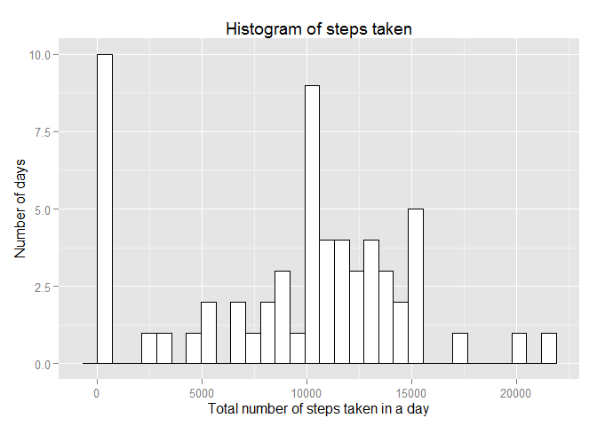
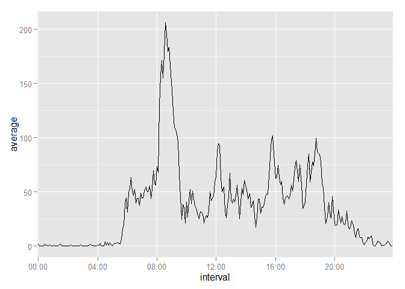
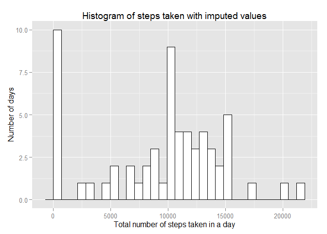
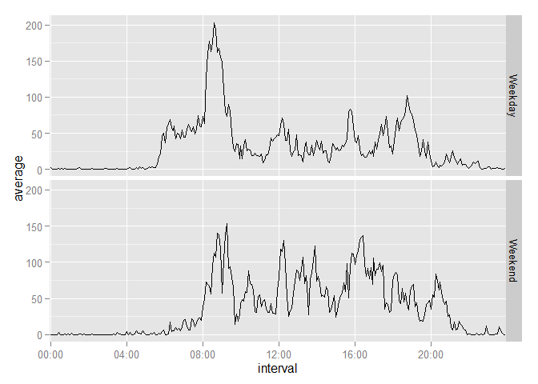

# Reproducible Research: Peer Assessment 1

## Introduction
Dear Peer Reviewer,

What follows is the first course assignment for the Coursera module "Reproducible Research". 

Thank you for your time.

## Loading and preprocessing the data
###Loading the data
The data are stored in a zip file, located in the working directory. Our first step is to extract it.


```r
data1 <- read.csv(unz("activity.zip","activity.csv"))
```

###Processing the data
We need to convert to the correct class of R object, which we can do with:


```r
data1$steps    <- as.numeric(data1$steps)
data1$date     <- as.Date(data1$date, "%Y-%m-%d")
data1$interval <- factor(data1$interval)
```

The forums are rife with discussion of how to turn the interval into a time - a difficult task without linking it to the date, and for much of what follows we need time and date to be separate. I've noticed that this discussion has even leaked over into the StackOverflow website (in an unashamed attempt by somebody to get help with their homework). My solution has been to simply have it as a factor. That way 55 automatically goes to 100 with no gap, because it's next.

## What is mean total number of steps taken per day?
Here I've used the dplyr package to group by date and summarize. As the data stands, we have the number of steps taken in particular intervals. We need to sum over the intervals on each date.

###Histogram


```r
library(dplyr)

data2 <- tbl_df(data1)  %>%
        group_by(date)  %>%
        summarise(total = sum(steps,na.rm=TRUE))
```

To show this graphically, I've used the ggplot2 package.


```r
library(ggplot2)

g <- ggplot(data2, aes(total))
g + geom_histogram(fill="white", colour="black") +
    labs(x = "Total number of steps taken in a day") +
    labs(y = "Number of days") +
    labs(title = "Histogram of steps taken")
```

 

We can see that there are a large number of days in which no activity occurs (perhaps the pedometer was sitting in a drawer for those days) but most of the time the individual concerned took between 10000 and 15000 steps.

###Mean and Median
This is most efficiently achieved with the summary() command. (I've stored the result so I can call on it in the text below.)


```r
data2sum <- summary(data2$total)
data2sum
```

```
##    Min. 1st Qu.  Median    Mean 3rd Qu.    Max. 
##       0    6778   10400    9354   12810   21190
```
We can thus see that the mean number of steps taken in a day is 9354 steps, while the median is 1.04\times 10^{4} steps. The fact that the mean is smaller reflects the large number of days with no steps taken.

## What is the average daily activity pattern?
###Time series plot
We require the average number of steps taken per interval.


```r
data3 <- tbl_df(data1)  %>%
        group_by(interval)  %>%
        summarise(average = mean(steps,na.rm=TRUE))
```

Which we plot thus:


```r
g <- ggplot(data3, aes(x=interval, y=average, group=1)) 
#group argument because interval is a factor
g + geom_line() +
    scale_x_discrete(
            breaks=c("0","400","800","1200","1600","2000"),
            labels=c("00:00","04:00","08:00","12:00","16:00","20:00")
            )
```

 

(The scale_x_discrete argument selects the intervals we wish to see, and then labels them. Ref: Chang, *R Graphics Cookbook* pages 178 and 180.)

###Which interval (on average) has most steps?


```r
data3[which.max(data3$average),]
```

```
## Source: local data frame [1 x 2]
## 
##   interval  average
## 1      835 206.1698
```

We can see that interval 835 - i.e. 08:35hrs - has the maximum, with 206.17 steps on average. Looks like our hero goes for a run in the morning!

## Imputing missing values
###Total missing values


```r
missing <- sum(is.na(data1$steps))
missing
```

```
## [1] 2304
```

There are 2304 missing values.

###Strategy for missing values

My strategy is to assume that the researcher carries on with what he was doing 5 minutes ago. This has huge flaws, in that if the researcher is doing something strenuous, deactivates the recorder and fails to notice until the following morning, then the strenuous activity will be seen to have carried on all night. But it's a strategy. We were told not to be too clever about it.

###Imputing missing values

First let's create the new dataset, datanew. We start by copying the original dataset.


```r
datanew <- data1
```

By chance, the first values are all NA:


```r
head(datanew)
```

```
##   steps       date interval
## 1    NA 2012-10-01        0
## 2    NA 2012-10-01        5
## 3    NA 2012-10-01       10
## 4    NA 2012-10-01       15
## 5    NA 2012-10-01       20
## 6    NA 2012-10-01       25
```

So I will begin by giving row one the mean value for interval "0". Then we use a for loop to replace each NA with the value above.


```r
datanew$steps[1] <- data3$average[1]
for(i in seq(along=datanew$steps)){
        if(is.na(datanew$steps[i])){
                datanew$steps[i] <- datanew$steps[i-1]
        }
}
```

###Histogram, mean and median

As above,


```r
data4 <- tbl_df(datanew)  %>%
        group_by(date)  %>%
        summarise(total = sum(steps))
```


```r
g <- ggplot(data4, aes(total))
g + geom_histogram(fill="white", colour="black") +
    labs(x = "Total number of steps taken in a day") +
    labs(y = "Number of days") +
    labs(title = "Histogram of steps taken with imputed values")
```

 

Mean and Median


```r
data4sum <- summary(data4$total)
data4sum
```

```
##    Min. 1st Qu.  Median    Mean 3rd Qu.    Max. 
##       0    6778   10400    9362   12810   21190
```
We can thus see that the mean number of steps taken in a day is 9362 steps, while the median is 1.04\times 10^{4} steps. This is interesting. The median remains the same, but the mean has changed slightly, from 9354 to 9362. 

## Are there differences in activity patterns between weekdays and weekends?

###Creating a factor for weekends and weekdays

Let's create two vectors called weekend and weekday.


```r
weekend <- c("Saturday","Sunday")
weekday <- c("Monday","Tuesday","Wednesday","Thursday","Friday")
```

We need to create a new vector called 'day'


```r
for(i in 1:17568){
        if(weekdays(datanew$date[i]) %in% weekday){
                datanew$day[i] <- "Weekday"
        } else {
                datanew$day[i] <- "Weekend" 
        }
}
datanew$day <- factor(datanew$day)
```

(On reflection, I could have just used the Weekday vector. Ho Hum.)


###Plot weekends and weekdays
Nearly there! Calling again on dplyr:


```r
data5 <- tbl_df(datanew)  %>%
        group_by(interval,day)  %>%
        summarise(average = mean(steps))
```

And lastly, our lineplot.


```r
g <- ggplot(data5, aes(x=interval, y=average, group=1)) 
g + geom_line() +
   facet_grid(day~.) +       
    scale_x_discrete(
            breaks=c("0","400","800","1200","1600","2000"),
            labels=c("00:00","04:00","08:00","12:00","16:00","20:00")
            )
```

 

Looks like our hero gets up earlier on weekdays!
